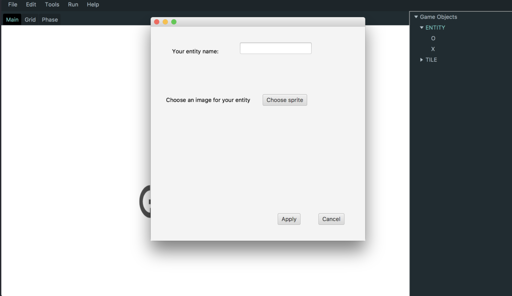

# Design Plan

## Introduction

For this project, our team will build an authoring environment and engine for team-based strategy games. Features of this game genre include sequential turns, the common manipulation of some shared space or model (whether it be a grid, like in checkers, or a layout in which you draw/play cards, like in Fluxx). 

Our design will need to support the ability to dynamically change the turn sequence (such as by skipping players or reversing direction), define multiple objectives (such as winning via elimination or attrition), create sprites of different function (like the pieces in chess), and manipulate the shared model (like moving pieces across the board). 
 
We hope to design the game authoring environment and game engine in such a way to provide the author with the most flexibility in terms of the behavior and logic of the gameObjects in a turn-based game. For example, the author will be able to designate exactly what the win conditions are, what should happen in every combination of moves, the functionality of each sprite, etc. We will have pre-defined drag-and-drop Groovy code blocks for them, as well as give them the user the ability to write their own Groovy code to execute. 

The front-end elements in the game authoring engine will support modularized design that allows users as much as possible, to customize their workspaces. They will be allowed to add/toggle different editing panels at different layers of the authoring interface, very much like PhotoShop. The back-end of the game authoring environment will provide the game author with tiles and grid. They are both configurable in terms of appearance and logic that are triggered by user-inputs. The game engine's Turn class will be entirely public, and new Sprites can be able to instantiated via Groovy code. 

## Overview

### Game Authoring Engine

The game authoring engine allows the author to have access to a pane, which consists of premade list of possible tiles. 

On another tab, the author can define gameObjects that this game consists of - their (class name, instance id) and other custom attributes that users can set. Also, the authors would be required to set a default sprite for each gameObjects, but they can also add custom logic that tells it to display different sprites depending on its instance attributes. Within the programming pane, the author can reference each instance of each class through (class name, instance id) pair. 

Once in the pane, the author can choose from a list of possible user inputs and define the possible effects each chosen input would have on the entity. In addition, there would also be a default option which does not depend on user inputs.

Once the authoring process is complete, the sprites, tiles and code blocks are mapped onto a xml file, and is stored in a folder together with the image resources.

Once the rules, objectives, and sprites are defined within the authoring environment, the game engine will populate its Finite Change Machine (FCM) graph with nodes representing behaviors in the game, as well as its Behavior class with appropriate actions to take at each node (such as querying the user for input, etc.) and which Token to append to the stack. This list of Tokens is used the traverse the FCM and, consequently, control the sequence of the game.

## User Interface

* This is the Edit Window where represents the game setting.


* This is pop up screen when the user wants to add gameObjects. 



* When the user clicks run from the menu, the scene for  game play pops up.


* When the user give behaviors on the game (i.e phase, entity).


## Design Details

### Game Engine

#### Phase class

This class contains a finite state machine that represents the actions and logic (see Node class, below) within each
turn. It contains a start node and a terminal node, which will change the Player whose turn it is and will start a
new Phase within the Turn class. It contains a "cursor" that will traverse the graph in the traverse() method.

#### Node class
This class contains execution code (in Groovy) that is defined by the author. Whenever the "cursor" is on a node,
certain Groovy code is executed.

#### Player class

This class contains the id of the player, as well as any stats (like score, HP, etc.) associated with him/her. It
also has the IDs of the entities they possess.

#### Entity class
This class contains the id of the sprite, its location (in terms of which Cell it's on), and any other related stats (like sprite HP, etc.). The logic of how this sprite is able to move is encoded within the edges of each Phase's FSM.

#### Tile class
Cells makes up the game's grid, which is an abstract concept in our design. Each cell has an id. The latter
information is important in games like chess, where the location of the piece may change its functionality (such as
when a pawn crosses to the opposing player's side). It also contains a set of Entities that may be on top of it.

#### Turn class
This class indicates the current phase and the current Player (whose turn it is). Its method startPhase() calls the
traverse method of the current Phase, which essentially starts the execution of game logic. If the win/lose condition
 is ever met (which are checked for during the validity checks within the Phase's graph), then the Turn class's endGame() method is called to end the game.

#### Initializer class
Based on the XML, this class initializes and displays the Cell, Entities, Players, Phases (and their FSMs), and
finally, the Turn class. This class then starts gameplay by calling startPhase() in the Turn class.

#### GameData class
Every Phase, Entity, Tile, and Player has an ID. In these classes, they reference each other by ID alone in order to
make serialization neater. The GameData class is populated with maps of every ID to object by the Initializer.

### Game Authoring

#### Grid Class

The Grid Class encapsulates the position and contains the tiles or sprites. It can hold either a list of lists or a map.

#### Tile Class

The tile class is responsible for storing the customization of the functionalities and the appearance of spaces in which the sprites reside. 

#### Sprite Class

The Sprite class is bound to each entity, and they hold the logic to multiplex the images depending on the entity's instance variables/global variables.

#### Stage Class

The Stage class encapsulates the fsm of user inputs that can happen under a stage. 

def initialCursor: Int 
def fsm: Map[Int, List[UserInput]]
 
#### UserInput Interface
User input serves as an edge for the fsm, with its side effects built via Block Code. It also has a "guard" that allows the fsm to check whether it's possible to move to "to" or not.

``` java
def to: Int
def guard: BlockCode 
def sideEffect: BlockCode
```

##### MouseClick (entity)

MouseClick class 

##### MouseDrag (fromEntity, toEntity)

##### KeyPressed (entity)


---
### Game Player

#### SaveState Class

This class is responsible for saving the current state of the game, whenever the user decides to navigate out of the game. It will keep the state of the Grid, current scores for each player, high scores, and all other stats relevant to the game. The XML generated from this game will be used by the engine in re-initialization. 

#### GameMenu Class
This class will display all the available games in a list with descriptions. Clicking on any of these will launch the games--if there are any saved states, the engine will run these, and if not, the game engine will reinitialize. 

---
### Game Data
Game data will be saved in the form of XML files. We will have a data folder with the images available to the author, and the filepaths of these images will be encoded in the XMLs for the game engine to access.

---
### Front-End 

- Wireframe

Main window for our program: It contains a menu bar, a side tree view, and a editor window in the middle


When the user clicks the "Run" button, a new window will appear like below


When the user is adding an entity to the storage, a new window will appear below to allow the user to add settings


- **View**
    - APIs
        - External
        - Internal
            - Data Interfaces
                - import data
                    - void importGame()
                    - void importEntities()
                    - void importPreferences()
                - update data
                    - void updateGame()
                    - void updateEntities()
                    - void importPreferences()
                - export data
                    - void exportGame()
                    - void updateEntities()
                    - void updatePreferences()
            
            - EditWindow
                - void updateEditView(): when the "apply" button is clicked
            - MenuBarView
                - void closeFile(ActionEvent event) 
                - void newFile(ActionEvent event) 
                - void openNewFile(ActionEvent event)
                - void redoChanges(ActionEvent event)
                - void runGame(ActionEvent event): when "run" button is clicked. Initialize GamePreView
                - void saveFile(ActionEvent event) 
                - void saveFileAs(ActionEvent event) 
                - void showAbout(ActionEvent event) 
                - void showHelpDoc(ActionEvent event) 
                - void undoChanges(ActionEvent event) 
            - SideView
                - **How to detect an object is dropped and update EditView
                    - **When there is an onDragStart event happening on the SideView, store that event somehow, and when there is a onDragExited event is detected, get information from the dragStart event and get the view from that place and put it here.
    - Classes that implement interface _SubView_ (contains method: Node getView())
        - `MenuBarView` (MenuBar containing all the buttons)
            - MenuBarView has one MenuBar JavaFx Node which has the following JavaFx MenuItem JavaFx Nodes.
            - File
                - New
                - Open
                - Save
                - Save as
            - Edit
                - Undo
                - Redo
            - Run
                - initialize a new GamePreView
            - Help
        - `SideView` (TreeView storing all the elements and supporting drag and drop)
                - Entity
                    - display instances of sprites
                - Sound
                    - store all the sound files
                - Tile Sets
                    - set shape of the grid and number of grid
            - Internal APIs
                - void addEntity(Entity);
                - void addSound(Sound);
                - void addTileSets(TileSets);
        - `EditView` (AnchorPane > TabPane > ScrollPane)
            - Representation of the game setting (e.g. gameObjects, grids)
            - Support Zoom in and zoom out
            - Internal APIs
                - void handleZoom();
                
- **EditWindow** (an abstract class)
    - EntityEditWindow (edit the characters settings)
        - A Dialogue box (pop up window in the same stage) for user to add an Entity element in the storage
    - SoundEditWindow (edit the sound setting)
        - A Dialogue box (pop up window in the same stage) for user to add a sound element in the storage
    - TileSetsEditWindow (edit the tile setting)
        - A Dialogue box (pop up window in the same stage) for user to add a sound element in the storage
- **GamePreView** (A new stage with the game itself, dependent of the backend data to run)
    - Take in everything from the EditView, combine with user's settings
- **Utils**
    - Entity
        - Name
        - Image
            - Static Image Builder (loading images)
            - Draggable Image Builder (Extending Static Image Builder, e.g. mouse event handler, set X position, set Y position)
            - HBox image Holder (images will be wrapped by Hbox) 
        - Actions (Depend on backend, e.g. move forward, move backward)
        - Size (width and height dependent of the size of the grid)
    - TileSets
        - A map or a 2D array
    
## Example Games
1. **Tic Tac Toe.** This 2-player involves each player making a mark on the grid of their designated symbol in turns. The one who gets 3 of their marks in a row first, wins. According to to our current design, there would be a single Phase that has only two Node: the startNode and terminalNode, which both ask the user for input, perform a validity check, and execute the placement of the Player's mark before the Turn class restarts the Phase with the second player. 
2. **Uno.** This game involves players trying to get rid of all of their cards the fastest. Cards they may play are restricted to those in their hand, and these cards may make other players draw cards, skip turns, etc. This game, unlike Tic Tac Toe, demonstrates the alteration of the turn sequence. Whenever a card is played (which, in our design, is translated as a card being placed on the Grid in a shared, designated space), either player data or the turn sequence (or both) will be manipulated. In the case of skipped turns, the logic within the Phase's FSM would just use the Turn class's setPlayer method to set the current player to the next next player's ID. This logic (encoded in Groovy) would also be able to handle manipulating player or sprite data. 
3. **Chess.** This 2-player game involves movement of pieces across the board to place the opposing player in a checkmate, or a position where their king piece cannot move safely. According to our design, the user will be able to define (in the authoring environment) validity checks for each piece, which essentially encapsulate its movement behavior. Logic can also be encoded for every Cell, which is useful in this game unlike in the others: for example, when pawns cross the board and retain the functionality of a queen, its validity check condition is switched to enable different movements. 

## Example code:

Pick at least 5 use cases and provide example “implementations” of them, using only methods from your code interfaces. Note, these should be separate Java code files in the folder doc/usecases that compile and contain extensive comments explaining how you expect your different APIs to collaborate. Note, you can implement each feature either in a single class to show how the steps are connected “procedurally” or in separate classes that implement the necessary interfaces to show how the steps are “distributed” across the objects. In either case, you will likely need to create simple “mocked up” objects that implement your interfaces so you have something concrete to create, using new, and call methods on.

1. The user runs the game for testing
    - src/frontend/src/authoringInterface/menu/MenuBarView.java
    ```java 
    public class GameWindow {
            Stage newWindow = new Stage();
            newWindow.setTitle("Your Game");
            Group group = new Group();
            Scene newScene = new Scene(group, GAME_WIDTH, GAME_HEIGHT);
            newWindow.setScene(newScene);
            newWindow.setX(MainAuthoringProgram.SCREEN_WIDTH*0.5 - GAME_WIDTH*0.5);
            newWindow.setY(MainAuthoringProgram.SCREEN_HEIGHT*0.5 - GAME_HEIGHT*0.5);
            newWindow.show();
            }

    ```

    - src/frontend/src/runningGame/GameWindow.java
    ```java
     void handleRunProject(ActionEvent event) {
         new GameWindow();
     }
    ```
2. The user adds an entity to be stored and re-used later
    - src/frontend/src/authoringInterface/spritechoosingwindow/**EntityWindow.java** -> provides a constructor for a new window to be displayed
    - src/frontend/src/authoringInterface/sidebar/SideView.java
        -         rootTreeView.setOnMouseClicked(event -> new EntityWindow(primaryStage));

3. The user can edit multiple games at the same time
    - src/frontend/src/authoringInterface/editor/EditView.java
    ```java
    private void addTab(){
        Tab tempTab = new Tab("Tab" + index);
        tempTab.setClosable(true);
        tempTab.setContent(gridScrollView.getView());
        tabPane.getTabs().add(tempTab);
        index++;
    }
    ```
    - Note, in the fourth line, `gridScrollView.getView()` needs to be changed. Each time when a new tab is created, a Controller is created

4. The user clicks on "Help"
    - The user can take a look at the guide in which they learn how to use our program be clicking on the “Help” button.
    ```java
    public void displayHelp(){
        Hyperlink webLink = new Hyperlink();
        webLink.setText("http://example.com");
        webLink.setOnAction(new EventHandler<ActionEvent>() {
        @Override
        public void handle(ActionEvent e) {
        System.out.println("This link is clicked");
        }
        });
    }
    ```

5. The user clicks on "Close"
    - The author can close his/her design and quit the program. The previous design will be auto-saved.
    ```java
        public void closeWindow(){
            GameEngine.save();
            primaryStage.close();
        }
    ```

## Example data:

```xml=
<Title>Tic Tac Toe</Title>
<Player name="p1" id="1">
	<Stat name="health"></Stat> <!-- relevant for players with other data (HP, points collected, score etc.) --> 
</Player>
<Player name="p2" id="2">
	<Stat name="health"></Stat> 
</Player>
<Sprite id="1">
	<Stat name="health"></Stat> <!-- relevant for sprites with data (not in this case) --> 
	<belongsTo>p1</belongsTo> <!-- also could be null, if belongs to no one --> 
	</img> <!-- id of image that is associated w/ sprite; ex. 1 = "X", 2 = "O"--> 
	<location></location> <!-- id of cell that it is on top of --> 
</Sprite>
<Sprite id="2">
	<Stat name="health"></Stat>
	<belongsTo>p1</belongsTo> 
	</img> 
	<location></location> 
</Sprite>
<Sprite id="3">
	<Stat name="health"></Stat> 
	<belongsTo>p1</belongsTo> 
	</img> 
	<location></location> 
</Sprite>
<Sprite id="4">
	<Stat name="health"></Stat> 
	<belongsTo>p1</belongsTo>
	</img> 
	<location></location> 
</Sprite>
<Sprite id="5">
	<Stat name="health"></Stat> 
	<belongsTo>p1</belongsTo> 
	</img> 
	<location></location> 
</Sprite>
<Sprite id="6">
	<Stat name="health"></Stat> 
	<belongsTo>p2</belongsTo>  
	</img> 
	<location></location> 
</Sprite>
<Sprite id="7">
	<Stat name="health"></Stat> 
	<belongsTo>p2</belongsTo> 
	</img> 
	<location></location> 
</Sprite>
<Sprite id="8">
	<Stat name="health"></Stat> 
	<belongsTo>p2</belongsTo>
	</img> 
	<location></location> 
</Sprite>
<Sprite id="9">
	<Stat name="health"></Stat> 
	<belongsTo>p2</belongsTo> 
	</img> 
	<location></location> 
</Sprite>
<Sprite id="10">
	<Stat name="health"></Stat> 
	<belongsTo>p2</belongsTo>
	</img> 
	<location></location> 
</Sprite>
<Grid>
	<Cell id="1">
		<containsSprites></containsSprites> <!-- IDs of the sprites it contains --> 
	</Cell>
	<Cell id="2">
		<containsSprites></containsSprites>	
	</Cell>
	<Cell id="3">
		<containsSprites></containsSprites>	
	</Cell>
	<Cell id="4">
		<containsSprites></containsSprites>	
	</Cell>
	<Cell id="5">
		<containsSprites></containsSprites>	
	</Cell>
	<Cell id="6">
		<containsSprites></containsSprites>	
	</Cell>
	<Cell id="7">
		<containsSprites></containsSprites>	
	</Cell>
	<Cell id="8">
		<containsSprites></containsSprites>	
	</Cell>
	<Cell id="9">
		<containsSprites></containsSprites>	</Cell>
	</Cell>
</Grid>
<Phase name="A">
	<Node>
		<isStart>true</isStart>
		<isTerminal>false</isTerminal>
		<action></action> <!-- Groovy code, sets the listener, validity check, execution, etc.--> 
	</Node>
	<Node>
		<isStart>false</isStart>
		<isTerminal>true</isTerminal>
		<action></action> <!-- Groovy code that also includes starting the next Phase and changing the player in Turn--> 
	</Node>
</Phase>
<currentPlayer>p1</currentPlayer> <!-- id of current player --> 
<global></global> <!-- any global data --> 
```

## Design Considerations

### Design Decision #1: Modular Design for Authoring Engine (front-end)

**Pros:** The different editing panels are modularized as much as possible. At each "level" of the editing interface, the user can add in any editing panels that implement the SubView interface as long as that level of the panel implements ParentView\<T> interface. It allows easy composition of the editing windows both for us developers and for the user in the future.

**Cons:** It's easy to implement these two interfaces, but it is hard to organize thse window panels in Parent window. After the user decides to add an Entity edit window into the panel, it is hard for the parent to automatically decide where to position that Entity endit panel.

**Our Rationale** These windows may be different for different kinds of games, and we do not want to initialize windows in a hard-coded way.

### Design Decision #2: Having Phase-Specific FSMs

**Pros:** Having a FSM specific to each phase makes it easier to implement different rules/difficulty/goals for various levels of a game. A single FSM that represents all the game logic would also have nodes specific to each player's turn, which provides unnecessary complexity. 

**Cons:** As mentioned above, a single FSM would allow for everyone's turn to be represented in the graph. This would encapsulate the logic of reversing, skipping, and adding turns. 

**Our Rationale** We decided to use phase-specific FSMs because it is more encapsulated than a game-wise FSM. As mentioned, it also allows for the easy addition of different levels, and it also separates the logic of turns into a separate class.

### Design Decision #3: Separating Turn logic from Entities

